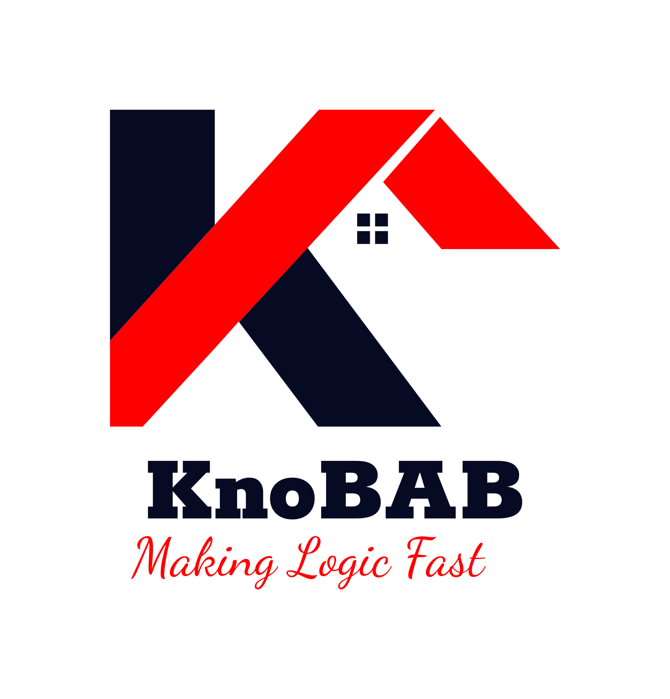

# KNOwledge Base for Alignments and Business process modelling

## Authors

*  Giacomo Bergami (2020-)
*  Samuel "Sam" Appleby (2022-)

## Log Generator

See the following branch: [loggen2](https://github.com/datagram-db/knobab/tree/loggen2)

## Mining+Inference Algorithm

See the following main entry point: src/knobab/mining/mining.cpp

## Cloning this branch

The suggested command to clone this project alongside its submodules and dependencies is the following:

    git clone --recurse-submodules -j8 --branch loggen git@github.com:datagram-db/knobab.git knobab2

## Results' Reproducibility (Latest Version)

This repository is associated with a Dockerfile. Therefore, a possible way to start in from a Linux environment is the following:

```bash
docker build -t "edbt24:DockerEDBT24" .
docker run -it "edbt24:DockerEDBT24" bash
```

The docker file will also automatically run the tests associated to the programs. As suggested in the paper, please also consider running the
given code using the dataset and scripts provided online via OSF anonymous submission: [https://osf.io/6y8cv/?view_only=3b8c01761fcf4941ad726aba4101151e](https://osf.io/6y8cv/?view_only=3b8c01761fcf4941ad726aba4101151e)

