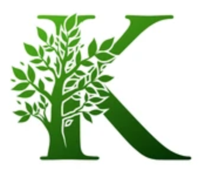

# KNOwledge Base for Alignments and Business process modelling

## Authors

 *  Giacomo Bergami (2020-)
 *  Samuel "Sam" Appleby (2022-) 


# Configurations 

After compiling the tool with CMake, the final project is delivered as a server(.exe) executable. By running it with the `--help` argument, the following message will be displayed:

```
  ./cmake-build-debug/server {OPTIONS}

    KnoBAB (c) 2020-2022 by Giacomo Bergami & Samuel 'Sam' Appleby.

  OPTIONS:

      -h, --help                        Display this help menu
      This group is all exclusive:
        -l[Log], --log=[Log]              The Log, in human readable format, to
                                          load into the knowledgebase
        -x[XES], --xes=[XES]              The Log in xes format to load into the
                                          knowledgebase
        -t[TAB], --tab=[TAB]              The Log in a tab separated format,
                                          with no event payload, to load into
                                          the knowledgebase
      You can use the following
      parameters
        -s, --server                      Runs the HTTP server for visualizing
                                          the internal representation of both
                                          the knowledge base and the associated
                                          query plan
        -n, --nostats                     Whether the code will lose time in
                                          calculating the statistics for the
                                          traces
        -d[Models/Queries...],
        --declare=[Models/Queries...]     The queries expressed as Declare
                                          models
        -b[Benchmark File],
        --csv=[Benchmark File]            Appends the current Result data into a
                                          benchmark file
        -s[SQLMinerDump],
        --sqlminer=[SQLMinerDump]         If present, specifies the dump for the
                                          SQL miner representation

    This free and open software program implements the MaxSat problem via a
    Knowledge Base, KnoBAB. Nicer things are still to come!


```

In order to run multiple queries stored in different files over one single model, you can run this command:

```
./cmake-build-debug/server  --log "data/testing/log.txt" --declare "data/testing/SimpleComposition.txt" "data/testing/InitSingleA.txt" "data/testing/InitSingleC.txt" --csv test.csv 
```

## Windows

### Toolchain
 * CLion 2021.3.3
   * CMake: Bundled (v 3.21.1)  
   * CMake Debug Generator: '''-G "Unix Makefiles"''''
 * Cygwin64 (v 3.3.4)
 * Cygwin GDB (v 10.2)
 
