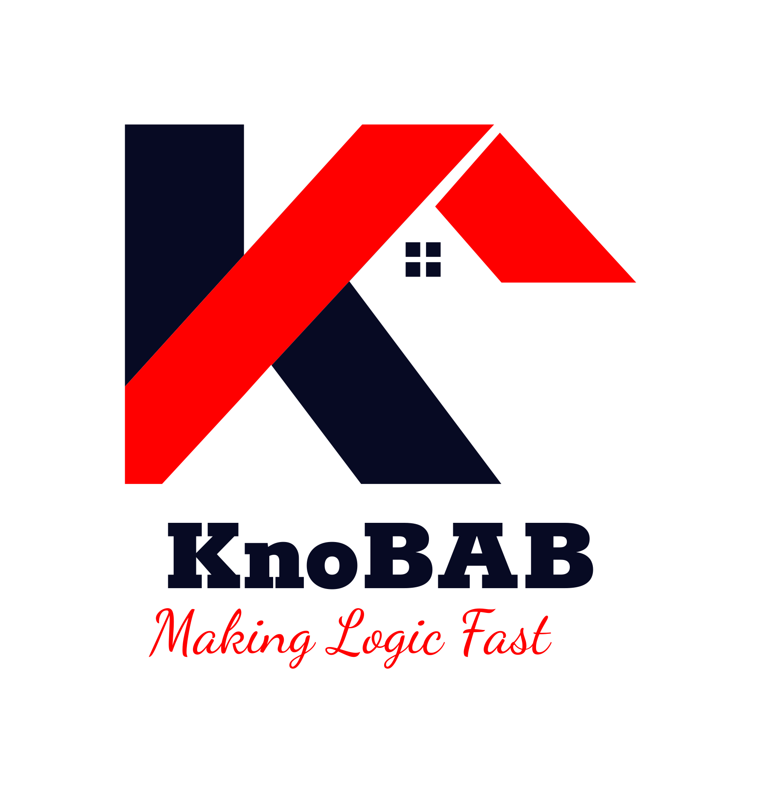

# KNOwledge Base for Alignments and Business process modelling

## Authors

*  Giacomo Bergami (2020-)
*  Samuel "Sam" Appleby (2022-2023)

## Cloning this branch

The suggested command to clone this project alongside its submodules and dependencies is the following:

    git clone --recurse-submodules -j8 --branch loggen git@github.com:datagram-db/knobab.git knobab2

## Results' Reproducibility (Legacy Versions)

Please refer to the [complete list](https://github.com/datagram-db/knobab/releases) of releases for any older version, chronologically ordered and associated to the appropriate paper name.