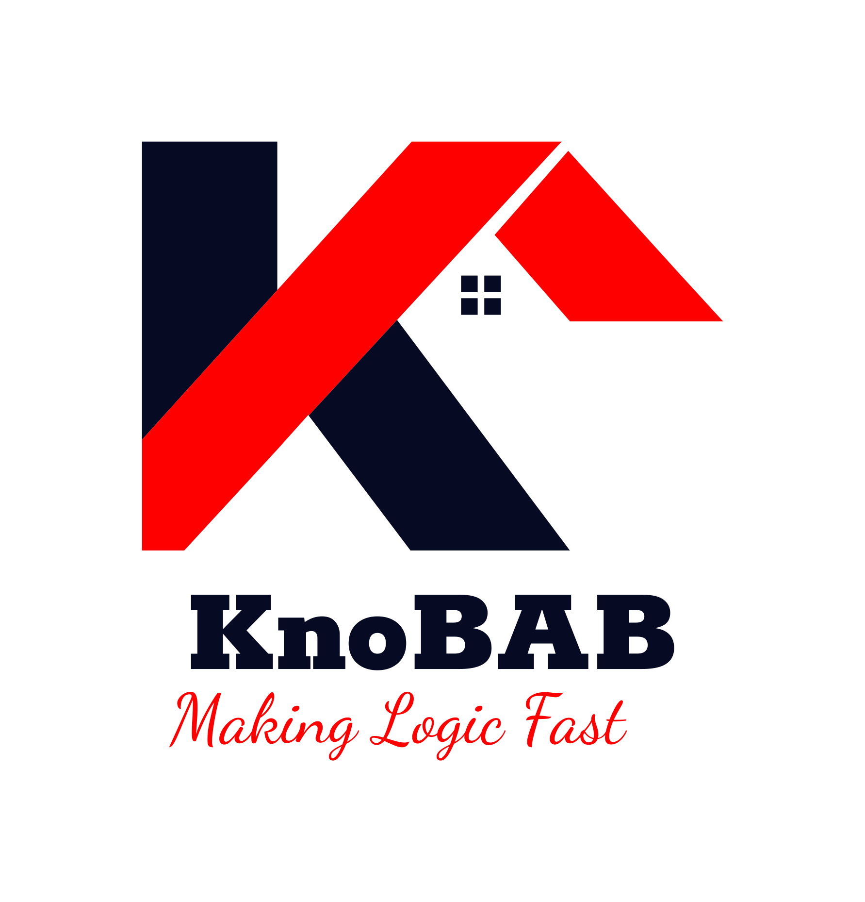

# KNOwledge Base for Alignments and Business process modelling

## Authors

*  Giacomo Bergami (2020-)
*  Samuel "Sam" Appleby (2022-)

## Log Generator

See the following branch: [loggen2](https://github.com/datagram-db/knobab/tree/loggen2)

## Mining+Inference Algorithm

**TODO**

## Cloning this branch

The suggested command to clone this project alongside its submodules and dependencies is the following:

    git clone --recurse-submodules -j8 --branch v2.0 git@github.com:datagram-db/knobab.git knobab2

## Windows
The present project can be compiled with the Visual Studio toolchain via CMake configuration. 

    cmake.exe -DCMAKE_BUILD_TYPE=<Debug|Release> -G "CodeBlocks - NMake Makefiles" -S <source> -B <build-folder>

Then, the process can be compiled as follows:

    cmake.exe <build-folder> --target all
